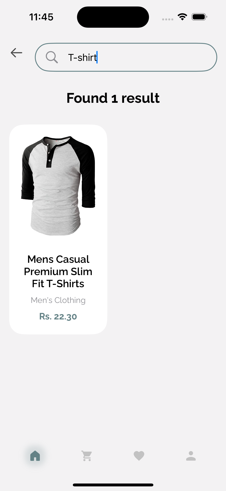

<!-- ABOUT THE PROJECT -->

## About The Project

### SWIFTUI E-clothing iOS Application With Firebase
How It works:
- Splash Screens, Login Screen and Registration Screen
  

    
    
    
  

- Home View, Search View
  

    
    
    
  

- Fully Search Screen
  

    
    
    
  

- Items Details View
  

    
    
  

- Faviourite Screens
  

    
    
  

  
- Add to Cart Screens
  

    
    
    
  

(<a href="#readme-top">back to top</a>)

### Built With

This is iOS e-clothing iOS Application development using SWIFTUI and Firebase realtime Database.

- [![SWIFTUI-document][Swiftui]][Swiftui]
- ![SWIFT][SWIFT]
- ![Firebase][Firebase]

(<a href="#readme-top">back to top</a>)

<!-- GETTING STARTED -->

## Getting Started

### Prerequisites

Install Xcode:

(<a href="#readme-top">back to top</a>)

<!-- MARKDOWN LINKS & IMAGES -->

[SWIFTUI-document]: https://developer.apple.com/documentation/swiftui/
[SWIFT]: https://img.shields.io/badge/swift-D9624D?style=for-the-badge&logo=swift&logoColor=white
[Firebase]: https://img.shields.io/badge/firebase-black?style=for-the-badge&logo=firebase&logoColor=FFCA27
[Swiftui]: https://img.shields.io/badge/swiftui-white?style=for-the-badge&logo=swift

